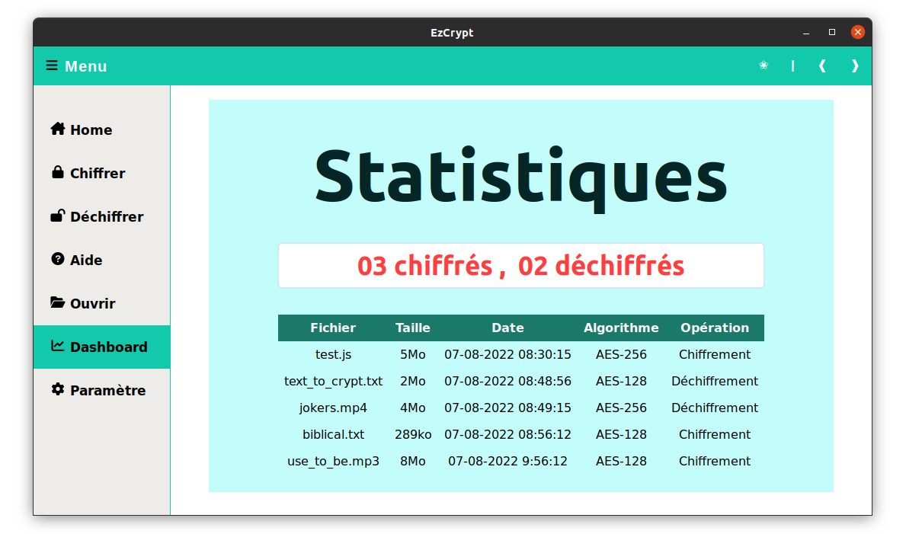

# EzCrypt
A Neutralino.js Lightweight Desktop App for files encryption / decryption...

Kinda figure out how good Neutralinojs (-_-) could be.

>_this is the cover, on this first page, the user can click signup for getting an user account before starting encryption and decryption

>_this is the signin page

>_this is the dashboard, it helps the user to monitor all the actions performed in real time.

